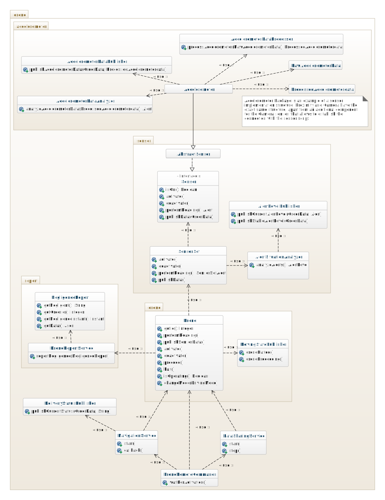
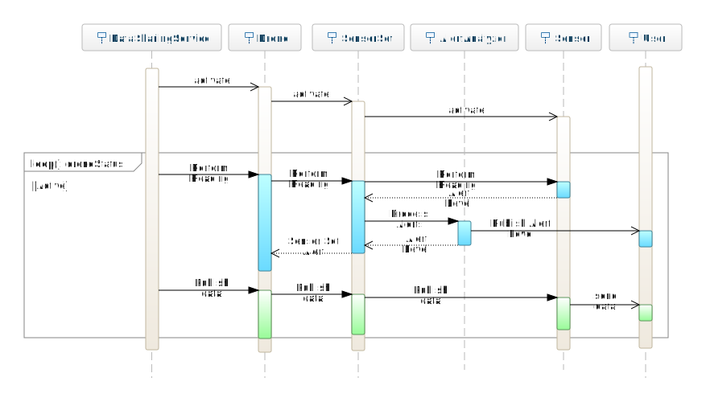

## Progettazione tecnica

### Requisiti del dominio

Per soddisfare un particolare requisito del dominio, ovvero la necessità di utilizzare dei sensori fisici, è
necessario usare _Raspberry Pi_ come dispositivo hardware per l'annessione dei sensori, il quale opera su una
distribuzione Linux.

Inoltre, per comunicare con tali sensori è presente la richiesta di utilizzare _Amazon Web Services_.
Perciò per potersi connettere al servizio remoto è opportuno utilizzare le relative librerie.

A questo punto, sfruttando tale servizio, si è in grado di gestire i cosiddetti _Digital Twin_, ovvero rappresentazioni
digitali di oggetti fisici.

### Scelte progettuali

#### Linguaggio

Ai fini del progetto, è stato evidente durante lo studio del dominio che un linguaggio a oggetti sarebbe
stato il più opportuno da utilizzare. È stato scelto _Java_ per il suo esteso utilizzo da parte degli sviluppatori
e quindi la disponibilità di molteplici framework, nonché per la sua portabilità rispetto al sistema operativo.

Per avere una compatibilità abbastanza alta del progetto ma contemporaneamente avere a disposizione una serie di
funzionalità del linguaggio abbastanza avanzate, è stato utilizzata la versione 11 del linguaggio, che introduce
costrutti i quali sono in grado di facilitare la scrittura/lettura del codice.
Avendo utilizzato Java 11, è stata sfruttata la possibilità di formare i cosiddetti _Java Modules_, i quali
permettono una serie di vantaggi, tra i quali scalabilità, maggior incapsulamento delle dipendenze ecc...

#### Distribuzione

Legato al discorso della portabilità, il vantaggio offerto da Java è l'opportunità di poter creare i cosiddetti _JAR_, 
ovvero pacchetti compressi contenenti tutto il software necessario affinché possano essere eseguiti indipendentemente
dal sistema operativo sottostante, avendo l'unico requisito di possedere una _Java Virtual Machine_ (JVM) capace di
eseguirli.

In particolare, per facilitare la distribuzione del progetto i due applicativi principali vengono pubblicati come JAR
già contenenti tutto il necessario per l'esecuzione. In questo modo l'utente non è costretto a compilare ed eseguire
manualmente il progetto.

#### Framework

I principali framework utilizzati sono i seguenti:
- [_JUnit_](https://junit.org/junit5/): al fine di eseguire test basilari, JUnit 5 è la scelta che abbiamo ritenuto 
  più ottimale per eseguire _unit testing_.
- [_JavaFX_](https://openjfx.io/): per essere più efficienti nello sviluppo dell'interfaccia grafica è stato scelto 
  JavaFX, il quale permette di sfruttare il proprio linguaggio di markup (_FXML_) evitando di dover costruire 
  l'interfaccia programmaticamente.
- [_Vert.x_](https://vertx.io/): per creare i servizi dell'applicativo utente in modo indipendente è stato scelto di 
  usufruire di Vert.x in quanto permette di creare web server. Inoltre, esso offre differenti componenti uno dei quali
  permette di relazionarsi con il database non relazionale [_MongoDB_](https://www.mongodb.com/).

Per modellare in modo indipendente ciascun servizio, è stata considerata l'opzione di utilizzare 
[_OpenAPI 3.x_](https://swagger.io/specification/), il quale
permette di configurare un server offrendo una specifica capace di definire tutte le informazioni relative a esso.
In questo modo è anche possibile tramite Vert.x validare le specifiche.

#### Build automation 

Come sistema di automazione di costruzione del progetto, è stato scelto _Gradle_, il quale permette di modularizzare il
progetto, offre la possibilità di creare script di automazione per agevolare la compilazione del codice,
riducendo la complessità della compilazione anche di progetti con una struttura estremamente sofisticata.
Inoltre, non obbliga l'utente a dover installare Gradle in locale sul proprio dispositivo in quanto il progetto mette a
disposizione il corrispettivo _wrapper_.
Come relativo linguaggio di scripting è stato utilizzato _KotlinDSL_.

#### Utilizzo dei sensori

Per poter usare i vari sensori erano presenti differenti soluzioni. La prima soluzione era utilizzare il linguaggio _C_,
ma questo è risultato essere complicato nell'integrazione con la JVM. 
Per questo motivo si è infine optato per il linguaggio di scripting _Python_, il quale permette una semplice integrazione
con Java, grazie alla possibilità di eseguire comandi come se fossero effettuati da terminale.

In questo modo, dopo aver ricevuto i dati dai sensori tramite gli script, l'applicativo riesce a comunicarli attraverso
AWS. A tal fine è necessario instaurare una connessione col servizio.
Attraverso opportune credenziali, è possibile identificare la copia remota del Drone con cui si vuole comunicare.
Perciò sono necessarie una serie d'informazioni per impostare correttamente la connessione. Per questo motivo
il sistema deve memorizzare questi parametri che saranno utilizzati per instaurare la connessione. Per accomodare
l'utente al riempimento dei valori è stata realizzata un'interfaccia grafica apposita.

#### Testing

Allo scopo di avere la verificabilità del codice realizzato sono stati implementati dei test che controllano 
le funzionalità base di alcuni elementi del progetto.
Poiché è stata ampiamente utilizzata la _Continuous Integration_, la quale però, per motivi
correlati alla mancanza di sicurezza nel condividere online i certificati privati relativi alla copia remota del Drone su AWS,
non permette di eseguire i test coinvolgenti AWS durante l'esecuzione della CI.

#### Performance

[//]: # ( TODO add performance documentation)

#### Continuous Integration

A questo proposito, la CI permette di controllare la validità delle specifiche OpenAPI, mediante _Github Actions_. 
Inoltre, ha lo scopo di controllare che il progetto sia correttamente compilato ed esaminato, anche tramite
controlli di qualità del codice.

Sono stati infatti aggiunti una serie di framework i quali hanno il compito di verificare la correttezza stilistica
del codice, eventuali bug o problemi inerenti attacchi conosciuti ai sistemi software, portando all'attenzione possibili
_bad practices_ non rilevate manualmente.

#### Versioning / Release

Tramite la CI, è stata configurata la cosiddetta 
[_Semantic Release_](https://semantic-release.gitbook.io/semantic-release/), la quale esegue controlli sui _commit_
per verificare se debba essere eseguita una _release_. Questo avviene grazie alla conformità dei commit su dei [_pattern
convenzionali_](https://www.conventionalcommits.org/en/v1.0.0/), i quali permettono d'individuare automaticamente
la versione del sistema software.

#### Version control strategies

Per quanto riguarda le strategie inerenti il _version control_, allo scopo di tenere traccia dei contesti nei quali
vengono effettuate le modifiche e quindi mantenerli in maniera incapsulata l'uno rispetto all'altro e inoltre,
per suddividere in maniera semantica il lavoro, si è ricorsi all'utilizzo di _branch_ denominati _feature_ che 
rappresentino le diverse funzionalità dell'applicativo, in modo tale che ciascun componente potesse operare sul branch
opportuno per evitare qualsiasi tipo di conflitto.
Infine, per poter assemblare tutte le modifiche effettuate dai feature branch, è stato utilizzato il _develop_ come
variante del progetto nella quale le modifiche non sono ancora definite pronte al rilascio finale sul _master_.

### Struttura del progetto

Il progetto si compone di più moduli: il modulo relativo al sistema del drone, il modulo relativo all'applicativo
dell'utente e un modulo aggiuntivo che si comporta da libreria fornendo funzionalità comuni ai precedenti moduli.

Il modulo denominato `user-application` è descritto sotto forma di diagramma delle classi nel modo seguente.
Per non ripetere inutilmente la struttura è rappresentato un singolo esempio che vale per ciascuno dei contesti creati.

Il modulo denominato `drone-system` è descritto sotto forma di diagramma delle classi nel modo seguente.

### Flussi di controllo

Si possono inoltre osservare i flussi di controllo i quali vengono descritti come diagrammi di sequenza dei 
diversi moduli.

Il modulo relativo al drone inizialmente in automatico si connette al proprio
_Digital Twin_ per attendere che l'utente gli assegni un ordine da consegnare. Dopo aver ricevuto il comando, il
drone attiva tutti i suoi componenti per iniziare il tragitto durante il quale legge costantemente
i dati ricevuti dai sensori e li analizza inviando i dati stessi, eventualmente accompagnati da segnalazioni 
di pericolo e negligenze.

Tale flusso è rappresentato nel diagramma seguente.

Invece, il modulo relativo all'applicativo dell'utente permette di eseguire l'autenticazione da parte dell'utente per
accedere come Corriere o Manutentore. Dopodiché l'utente può osservare le segnalazioni relative ai droni o le 
segnalazioni per negligenze tramite le apposite interfacce grafiche.
Nel caso specifico in cui l'utente sia un Corriere, l'applicativo è in grado di mostrare l'insieme degli ordini che gli
sono stati assegnati.
D'altro canto se l'utente è un Manutentore, egli possiede le capacità di gestione delle segnalazioni.

Per esempio di seguito è rappresentato il flusso relativo all'esecuzione di una consegna.

