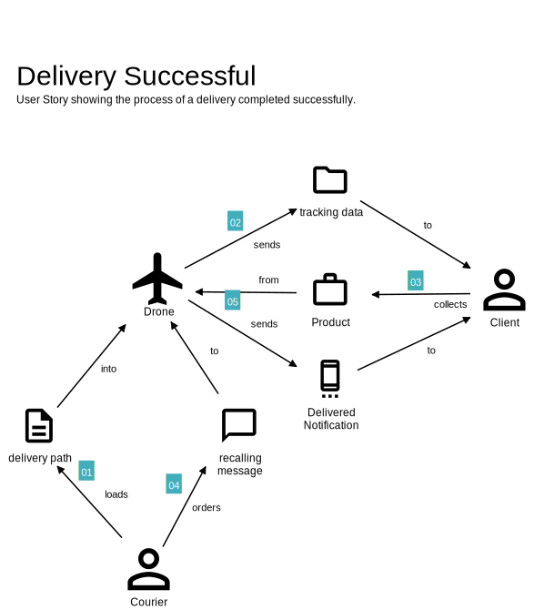
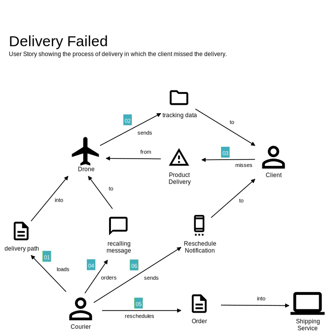
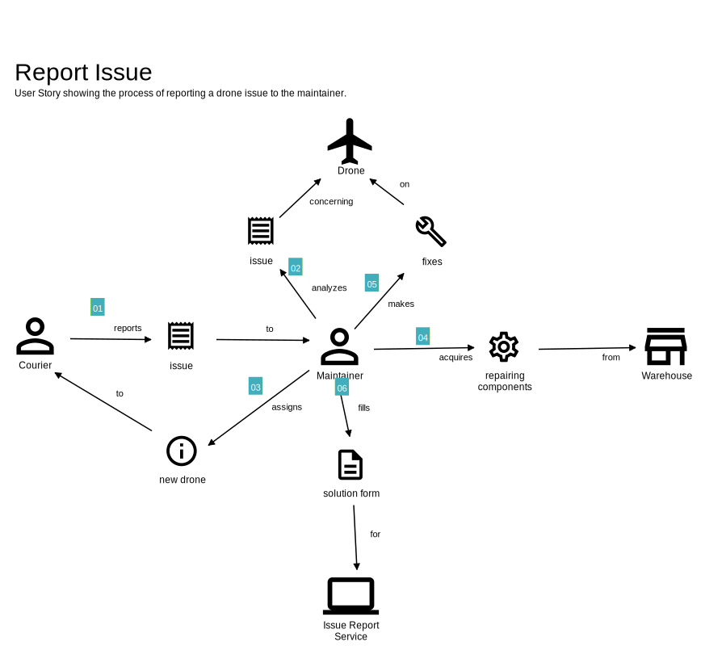
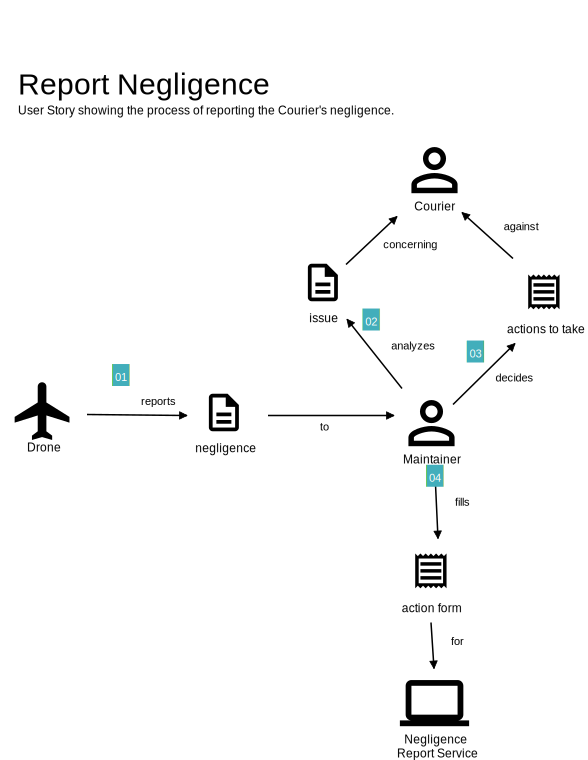

## Casi d'uso

Assumendo di aver interloquito con gli esperti del dominio che si vuole descrivere,
si è giunti insieme a una descrizione di tutti i possibili casi d'uso.
Il diagramma qui indicato riporta la rappresentazione visuale in forma di UML.

Sostanzialmente, i principali attori del dominio interagiscono con il sistema o mediante 
quest'ultimo tra di essi in differenti maniere al fine di costruire tutte le funzionalità
che devono essere presenti.

Innanzitutto, si può osservare come il **Drone** sia in grado di eseguire un analisi dei dati 
la quale permette di rielaborare i valori grezzi in informazioni preziose. 
Grazie all'accurata analisi effettuata, i dati possono essere continuamente monitorati dai
due utenti fisici principali del sistema: **Corrieri** e **Manutentori**.
Nel caso in cui il **Drone** riveli, tramite i propri sensori, una situazione pericolosa, una
notifica giungerà al **Corriere** che sta monitorando quel **Drone** in modo tale da poter effettuare
manovre di correzione di rotta.
Inoltre, nel caso in cui il **Corriere** non sia riuscito per un qualche motivo a cambiare rotta,
il sistema posizionato sul **Drone** è capace di eseguire una manovra d'arresto per la quale
tentare di prevenire un incidente data la situazione estremamente pericolosa per l'incolumità del
**Drone** stesso o dell'ostacolo.
A questo punto il **Drone** invia una segnalazione per negligenza del **Corriere** a un determinato 
**Manutentore**. 
In questo modo egli potrà revisionare l'accaduto e prendere provvedimenti verso il 
negligente. 

D'altro canto, il **Corriere** può invece segnalare un malfunzionamento del **Drone** proprio al 
**Manutentore**, il quale si occuperà di controllare fisicamente il **Drone** e i suoi componenti
e correggerà il problema compilando inoltre una scheda in cui viene descritto il problema
e la sua risoluzione.

Come punto di partenza, il **Cliente** è l'attore principale. Egli infatti potrà effettuare un
ordine cosicché il **Corriere** potrà eseguire la consegna associata a un determinato **Drone**.
Durante la consegna il **Cliente** potrà inoltre tracciare la posizione corrente del **Drone** per
verificarne la distanza dal punto di arrivo.
A questo punto se il ritiro viene effettuato correttamente verrà inviata una notifica al
**Cliente** per avvisarlo dell'avvenuta consegna.
Contrariamente, nel caso di mancato ritiro, il **Corriere** potrà riprogrammare la consegna 
per un giorno lavorativo successivo e il **Cliente** verrà notificato del nuovo tentativo di
consegna.

## User Stories

In seguito allo studio del caso sono stati studiate le User Stories che descrivono i comportamenti
del sistema in delle particolari circostanze. In totale sono state ottenute cinque User Stories:
 - Prevenzione dell'incidente;
 - Consegna eseguita con successo;
 - Consegna non ritirata;
 - Segnalazione di una rottura del drone;
 - Segnalazione di una negligenza del corriere.

Queste User Stories sono rappresentate dai grafici mostrati di seguito.

