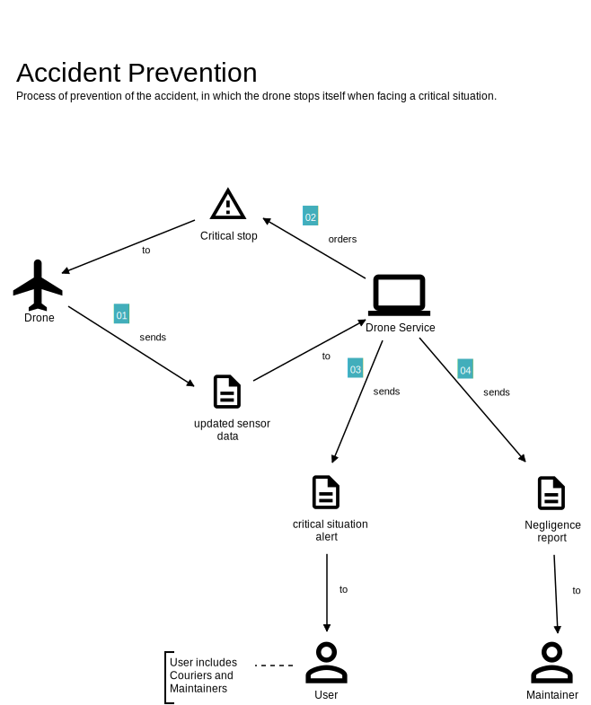
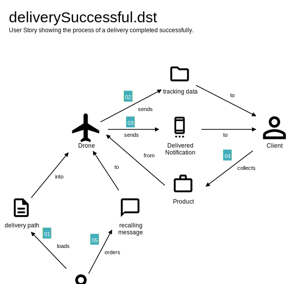
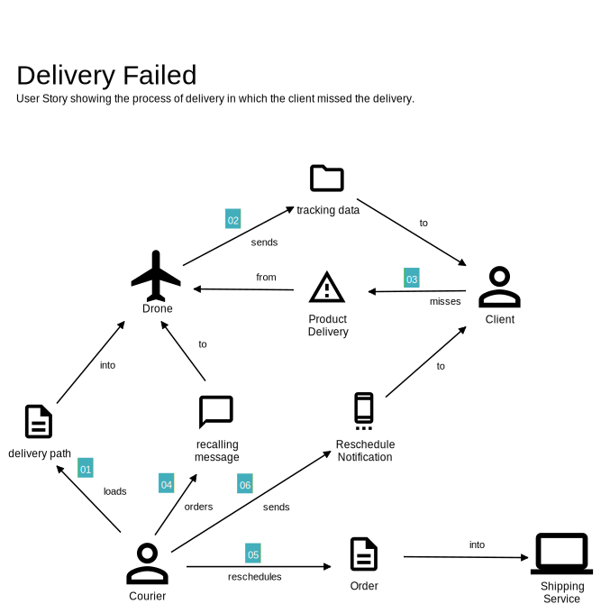
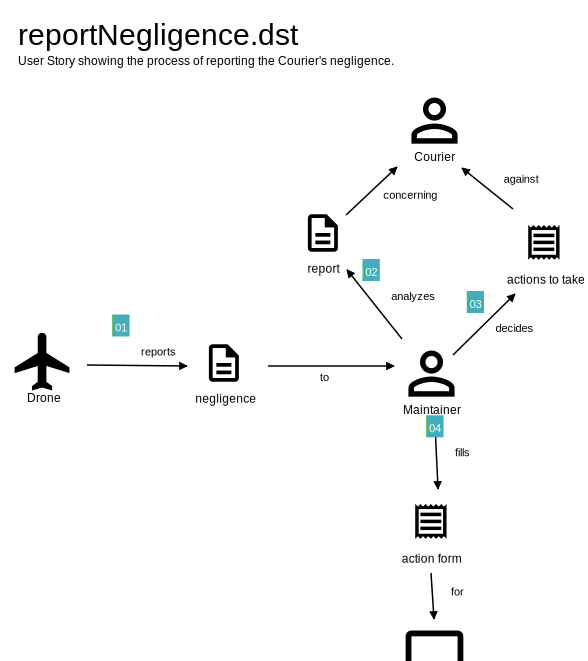

## User Stories

In seguito allo studio dei casi d'uso sono stati studiate le User Stories che descrivono i comportamenti
del sistema in particolari circostanze. In totale sono state ottenute cinque User Stories:
- Prevenzione dell'incidente;
- Consegna eseguita con successo;
- Consegna non ritirata;
- Segnalazione di una rottura del drone;
- Segnalazione di una negligenza del corriere.

Queste User Stories sono rappresentate dai grafici mostrati di seguito.

